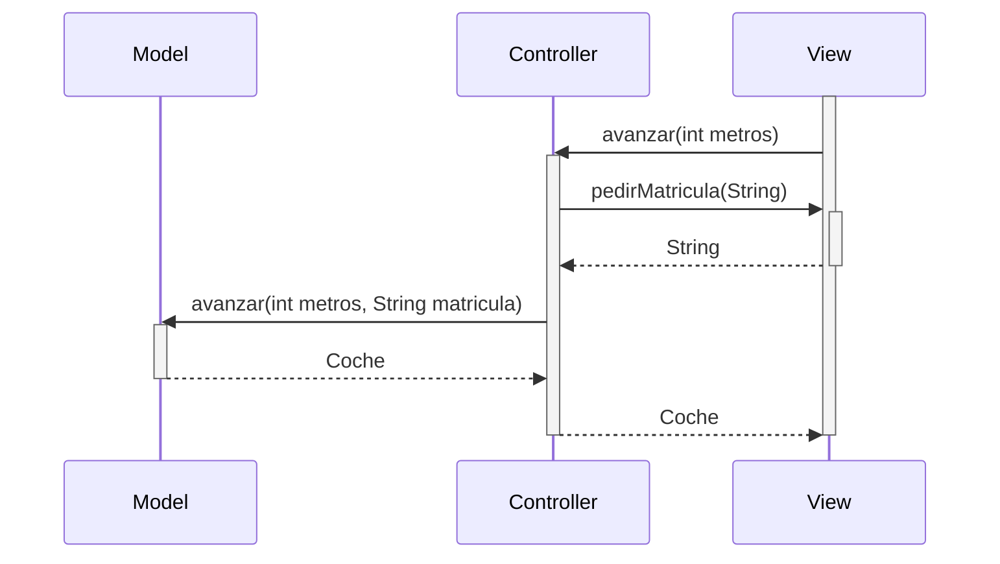
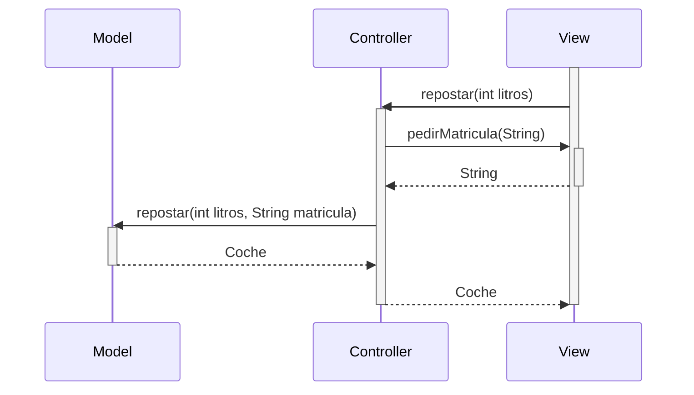
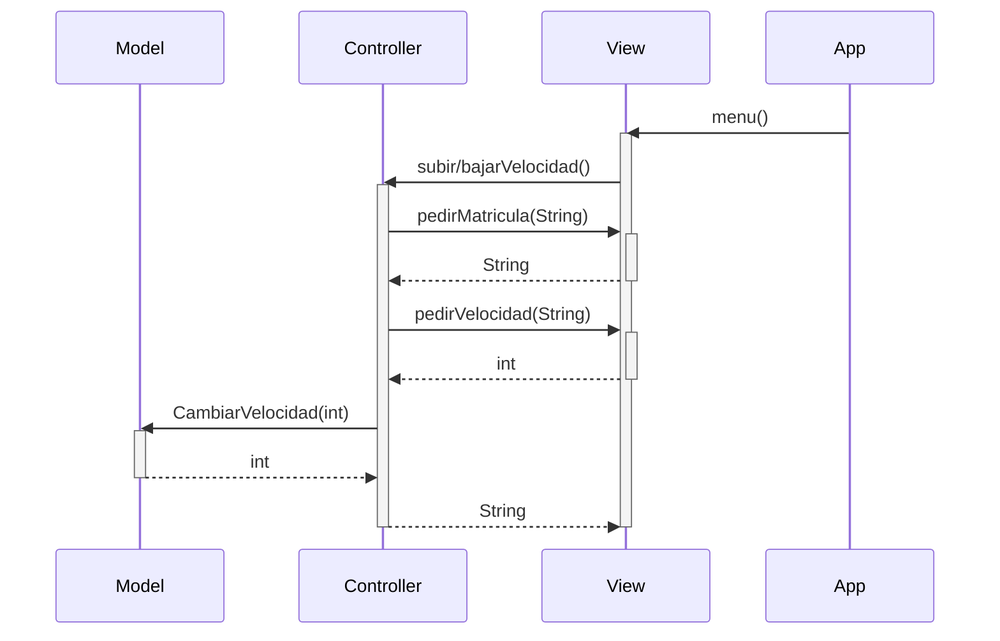
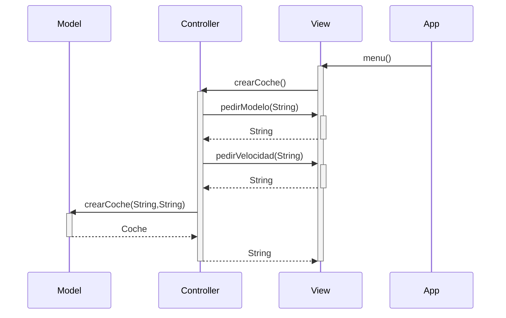

## Avanzar:

```mermaid
sequenceDiagram
    participant Model
    participant Controller
    participant View
    activate View
    View->>Controller:avanzar(int metros)
    activate Controller
    Controller->>View:pedirMatricula(String)
    activate View
    View-->>Controller:String
    deactivate View
    
    
    Controller->>Model:avanzar(int metros, String matricula)
    activate Model
    Model-->>Controller:Coche
    deactivate Model
    Controller-->>View:Coche
    deactivate Controller
    deactivate View
```

## Repostar:

```mermaid
sequenceDiagram
    participant Model
    participant Controller
    participant View
    activate View
    View->>Controller:repostar(int litros)
    activate Controller
    Controller->>View:pedirMatricula(String)
    activate View
    View-->>Controller:String
    deactivate View
    
    
    Controller->>Model:repostar(int litros, String matricula)
    activate Model
    Model-->>Controller:Coche
    deactivate Model
    Controller-->>View:Coche
    deactivate Controller
    deactivate View
```

## Cambiar velocidad:

```mermaid
sequenceDiagram
    participant Model
    participant Controller
    participant View
    participant App
    App->>View:menu()
    activate View
    View->>Controller:subir/bajarVelocidad()
    activate Controller
    Controller->>View:pedirMatricula(String)
    activate View
    View-->>Controller:String
    deactivate View
    Controller->>View:pedirVelocidad(String)
    activate View
    View-->>Controller:int
    deactivate View
    Controller->>Model:CambiarVelocidad(int)
    activate Model
    Model-->>Controller:int
    deactivate Model
    Controller-->>View:String
    deactivate Controller
    deactivate View
```

## Crear coche:

```mermaid
sequenceDiagram
    participant Model
    participant Controller
    participant View
    participant App
    App->>View:menu()
    activate View
    View->>Controller:crearCoche()
    activate Controller
    Controller->>View:pedirModelo(String)
    activate View
    View-->>Controller:String
    deactivate View
    Controller->>View:pedirVelocidad(String)
    activate View
    View-->>Controller:String
    deactivate View
    Controller->>Model:crearCoche(String,String)
    activate Model
    Model-->>Controller:Coche
    deactivate Model
    Controller-->>View:String
    deactivate Controller
    deactivate View
```
